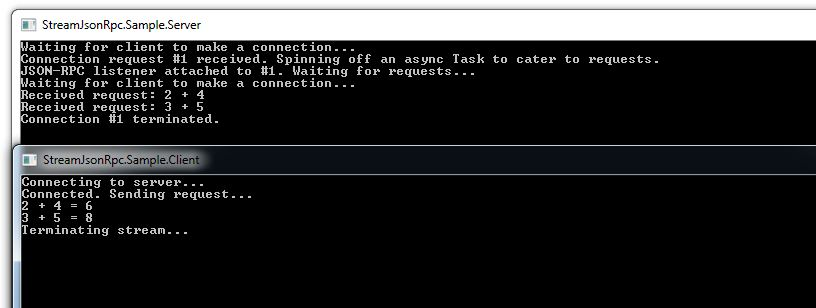
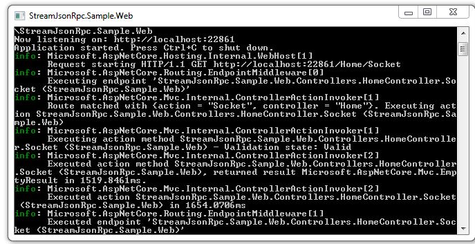
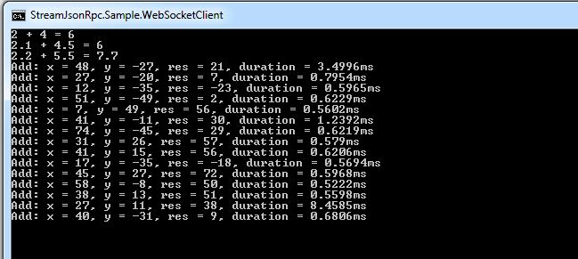
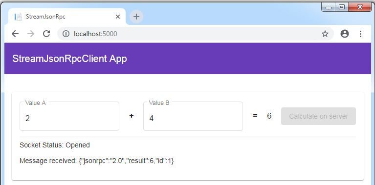
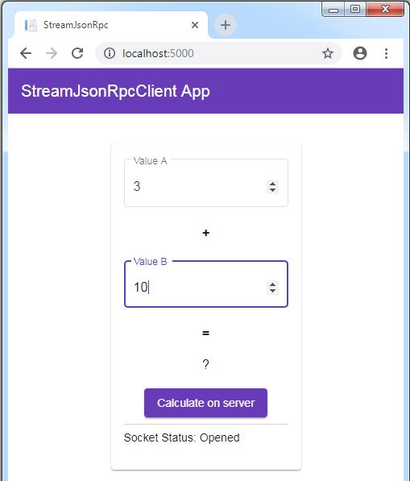

# StreamJsonRpc.Samples
Sample use of StreamJsonRpc: .NET Core 2.2, StreamJsonRpc 2.0.187

These samples are based on the - https://github.com/AArnott/StreamJsonRpc.Sample project

**Client/Server processes over named pipes:**

**WebSocket Server:**

**WebSocket C# Console Client:**

**Web Client:** Angular 8.0.2, flex-layout 8.0, Material 8.0.0

